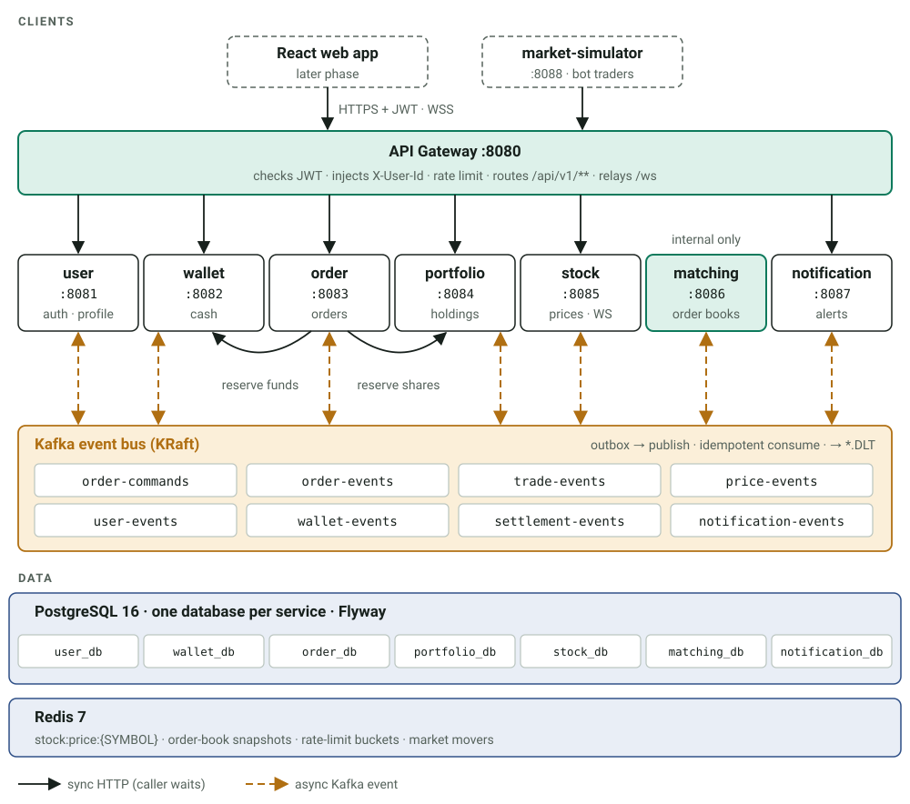
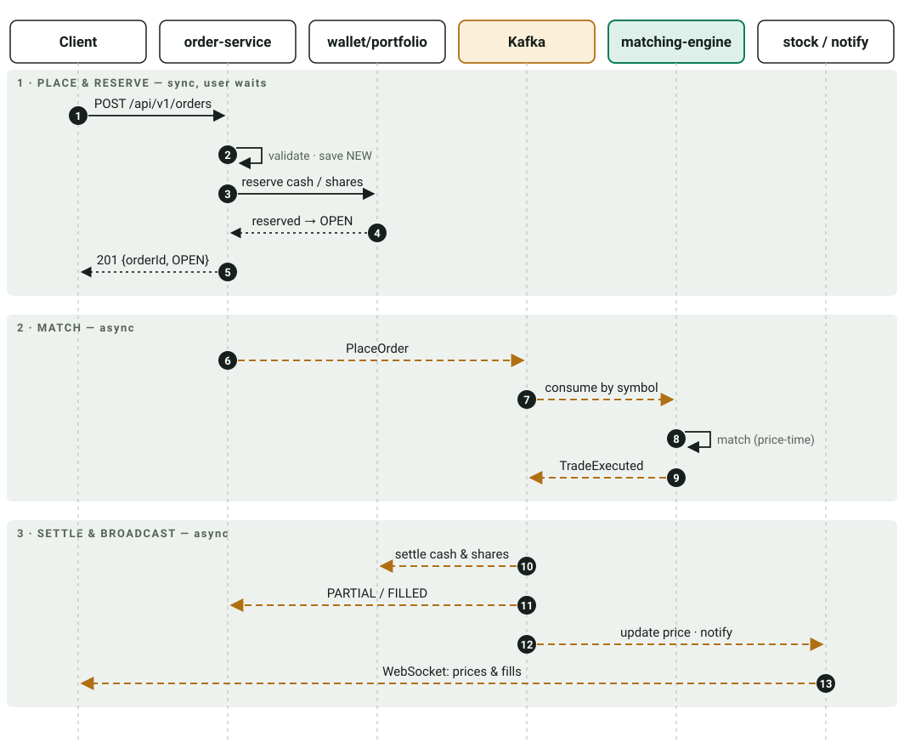
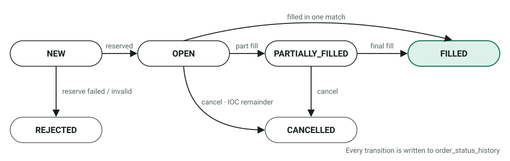
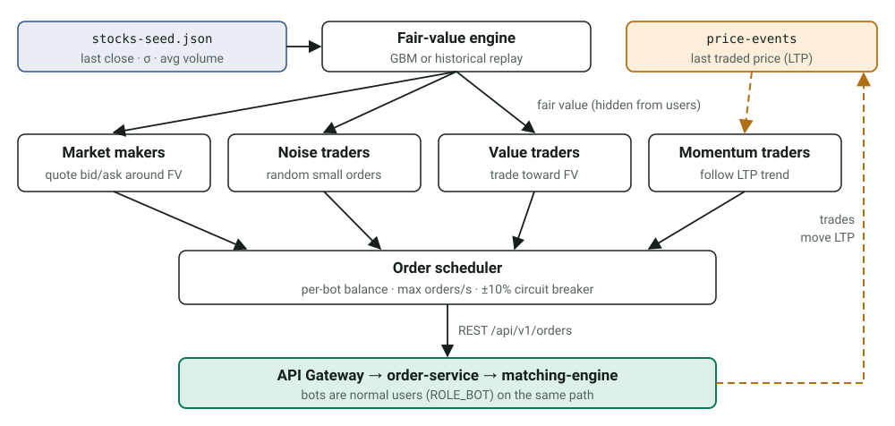
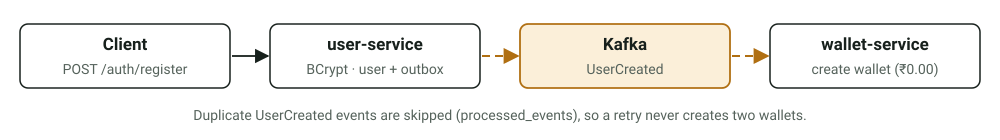

# Nexus Exchange — Target Architecture (Backend)

> Status: **Accepted v1.0** · Owner: Kartik · Last updated: 2026-09-24
> Diagrams are SVG files in [`docs/diagrams/`](diagrams/). They stay sharp at any zoom, and you can open them directly in a browser.
> This document replaces `Stock_Exchange_Simulator_Architecture.pdf` as the source of truth. Decisions marked **(ADR)** were accepted on 2026-09-24 and are recorded in [`docs/adr/`](adr/README.md).

---

## 1. Goal and scope

A Zerodha-style **stock exchange simulator**. Users register, fund a virtual wallet, watch live prices, place BUY/SELL orders, get matched by a real price-time-priority matching engine, and see their portfolio and P&L update in real time.

In scope (backend): identity, wallet, market data, orders, matching, settlement, portfolio, notifications, real-time streaming, observability, CI/CD, container deployment.
Out of scope for now: frontend (React, later phase), real market data feeds, real money, brokerage fees/taxes (optional later), options/derivatives.

### Non-functional targets (simulator-grade, not production-exchange-grade)

| Area | Target |
|---|---|
| Matching latency | < 5 ms p99 inside the engine for a single order |
| Throughput | ≥ 1,000 orders/sec across all symbols on a laptop |
| Price update fan-out | ≤ 1 s from trade to WebSocket clients |
| Correctness | No money or shares created/destroyed — ledger must always balance |
| Recovery | Any service can restart without losing orders, trades or balances |

---

## 2. Tech stack decisions

| Concern | Decision | Why / notes |
|---|---|---|
| Language / runtime | **Java 21** (virtual threads enabled for blocking I/O) | Already in use |
| Framework | **Spring Boot 3.5.x**, Spring Cloud **2025.0.x** | Already in use; Cloud needed for Gateway |
| Build | **Maven multi-module** (root `pom.xml` as parent + `dependencyManagement`) | Already in use; centralise versions |
| API Gateway | **Spring Cloud Gateway** | Routing, JWT validation, rate limiting, WS proxy |
| Service discovery | **None — static DNS names** (docker-compose / Kubernetes service names) (ADR) | Eureka adds complexity with no benefit for a solo project |
| Config | Spring profiles (`local`, `docker`, `k8s`) + **environment variables**; no Config Server (ADR) | Simple; secrets never committed |
| Database | **PostgreSQL 16**, **one database per service** on the same server (ADR) | Keeps service boundaries honest without running 7 Postgres containers |
| Migrations | **Flyway**; `ddl-auto: validate` | Replaces `ddl-auto: update` |
| Messaging | **Apache Kafka 3.x in KRaft mode** (drop Zookeeper) (ADR) | Fewer containers, current Kafka default |
| Kafka client | Spring Kafka, JSON serde with type headers; **DLT** via `DefaultErrorHandler` | |
| Cache / fast state | **Redis 7** | Latest prices, order-book snapshots, rate limiting, WS session hints |
| Security | **Spring Security + JWT** (access 15 min, refresh 7 days). **HS256** shared secret first, **RS256 + JWKS** optional later (ADR) | Token issued by user-service, validated at the gateway |
| Password hashing | **BCrypt** (strength 12) | Replaces `hashCode()` mock |
| Real-time | **WebSocket + STOMP** (Spring messaging), relayed through the gateway | Matches the original design |
| Resilience | **Resilience4j** (timeouts, retry, circuit breaker) on sync calls | |
| API docs | **springdoc-openapi**, aggregated at the gateway | Already in 4 services |
| Mapping | **MapStruct** (ADR — or keep hand-written mappers) | Removes boilerplate |
| Logging | SLF4J + Logback, **JSON logs** (logstash-encoder), `X-Request-Id` correlation in MDC | |
| Metrics / tracing | Actuator + **Micrometer → Prometheus → Grafana**; **OpenTelemetry → Tempo/Zipkin** for traces | |
| Testing | JUnit 5, Mockito, AssertJ, **Testcontainers** (Postgres, Kafka, Redis), **k6** load tests | |
| Money & quantity | **`BigDecimal` / `NUMERIC(19,4)`** for money, **`long` / `BIGINT`** for share quantity | `Double` is never acceptable for money |
| Containers | Docker (multi-stage builds or Jib), docker-compose for local | |
| CI/CD | **GitHub Actions** → build, test, push images to **GHCR** | |
| Orchestration | **Kubernetes** (kind/minikube locally) with Kustomize manifests | Final phase |
| Market seed data | **Kaggle NIFTY 50/100 minute CSVs**, processed offline by a Python script into `stocks-seed.json` | No runtime dependency on outside APIs (§4.6) |

---

## 3. High-level architecture



### Services

| Service | Port | Owns | Responsibilities |
|---|---|---|---|
| api-gateway | 8080 | — | Routing, JWT validation, `X-User-Id`/`X-User-Role` injection, CORS, rate limiting, WebSocket relay, aggregated Swagger |
| user-service | 8081 | `user_db` | Register, login, refresh/logout, profile, roles (USER/ADMIN), emits `UserCreated` |
| wallet-service | 8082 | `wallet_db` | Wallet per user, deposit/withdraw, **fund reservations** for BUY orders, trade settlement (cash leg), immutable ledger |
| order-service | 8083 | `order_db` | Place/cancel/query orders, validation, reservation orchestration, order state machine |
| portfolio-service | 8084 | `portfolio_db` | Holdings, **share reservations** for SELL orders, average price, realised/unrealised P&L, settlement (share leg) |
| stock-service (market data) | 8085 | `stock_db` | Stock master data, last price/OHLC from trades, price history & candles, Redis cache, WebSocket price & order-book broadcast |
| matching-engine | 8086 | `matching_db` | In-memory order book per symbol, price-time priority matching, emits trades |
| notification-service | 8087 | `notification_db` | Stores and pushes user notifications (WebSocket user queue; email later) |
| market-simulator | 8088 | — (config + `stocks-seed.json`) | Fair-value model (GBM or historical replay) and bot agents (market makers, noise, value, momentum) that trade through the gateway — §4.6 |
| common-library | — | — | Events, enums, DTO envelopes, exceptions, error handling auto-config, logging/MDC filter |

`connectivity-test-service` is retired; its checks become Actuator health indicators in each service.

---

## 4. Key design decisions

### 4.1 Order lifecycle — hybrid saga

Placing an order uses **synchronous reservation** so the user gets an immediate answer. Everything after the order reaches the engine is **asynchronous and event-driven**, as a choreographed saga.



**Order state machine**



- **Cancel**: order-service sends `CancelOrder` on `order-commands`. The engine removes the order and emits `OrderCancelled {remainingQty}`. Wallet/portfolio then release the remaining reservation.
- **MARKET orders** are IOC (immediate-or-cancel). BUY market reserves `lastPrice × qty × 1.05`. Any unfilled remainder is cancelled by the engine, and any unused reserve is released.
- **LIMIT BUY price improvement**: if the fill price is below the limit, the difference is released back to available balance.
- **Self-trade prevention**: a user's buy never matches their own sell (the resting order is cancelled).

### 4.2 Matching engine

- One `OrderBook` per symbol: bids in a `TreeMap<BigDecimal, ArrayDeque<BookOrder>>` sorted by descending price, asks by ascending price. This gives price-time priority (FIFO within a price level) and O(log n) inserts.
- **Single writer per symbol.** Kafka `order-commands` is keyed by symbol, so each symbol is always processed by one consumer thread in order. No locks are needed inside the book.
- The engine is a **pure Java module** (`matching-core`, no Spring) with a thin Spring Kafka wrapper. That keeps it trivially unit-testable.
- **Persistence and recovery**: open orders are stored in `matching_db.book_orders` and trades in `matching_db.trades`, written in the same transaction as the outbox rows. On startup the engine rebuilds books from `book_orders`. Consumer offsets are committed after the DB commit, and a duplicate command is ignored by `command_id`.
- It emits `TradeExecuted` (topic `trade-events`, key = symbol) and `OrderCancelled`/`OrderRejected`/`OrderBookUpdated` (topic `order-events`). Order-book depth snapshots (top 10 levels) are throttled to ~4/sec.

### 4.3 Reliable messaging

- **Transactional outbox** in every producing service: the state change and the `outbox` row are written in one DB transaction, and a poller (or Debezium later) publishes to Kafka. No dual-write bugs.
- **Idempotent consumers**: every consumer stores `event_id` in `processed_events` in the same transaction as its state change and skips duplicates.
- **Retries + DLT**: 3 retries with backoff, then `<topic>.DLT`. A small admin endpoint lists and replays DLT messages.
- **Compensation**: if settlement fails permanently on one leg (e.g. portfolio), a `SettlementFailed` event makes wallet reverse its ledger entry and marks the trade `SETTLEMENT_FAILED` for manual review. This is the saga from the original design.

### 4.4 Security

- user-service issues a JWT with `sub=userId`, `role` and `jti`. Refresh tokens are stored hashed in `refresh_tokens`, rotated on each use and revocable.
- The gateway validates the JWT, **strips any client-supplied `X-User-*` headers**, then injects `X-User-Id`, `X-User-Role` and `X-Request-Id`.
- Downstream services trust these headers only from the internal network. `/internal/**` endpoints are not routed by the gateway.
- Admin-only endpoints (`/api/v1/admin/**`) require `ROLE_ADMIN`.
- Rate limit: Redis token bucket, e.g. 20 orders/sec per user.

### 4.5 Market data and real time

- stock-service consumes `trade-events` and updates last price, day OHLC and volume. It writes `stock:price:{SYMBOL}` to Redis, appends to `stock_price_history`, builds 1-minute candles and publishes `StockPriceUpdated` on `price-events`.
- STOMP destinations:
  - `/topic/prices` (all ticks) and `/topic/prices/{symbol}`
  - `/topic/orderbook/{symbol}`
  - `/user/queue/orders` and `/user/queue/notifications` (per user, served by notification-service)
- The market simulator keeps prices moving: bot users with seeded wallets and holdings place limit and market orders. See §4.6.

### 4.6 Market simulation & seed data

**Principle:** prices on Nexus Exchange are made by trades in our own matching engine. We never mirror a live feed. Outside data is used for two things only:
1. **Seeding** each stock with a realistic starting price, volatility and volume.
2. **Steering** bot traders so that the prices they produce look like a real market.

#### Data sources

| Source | Used for | When | Notes |
|---|---|---|---|
| [Kaggle — Nifty 50 minute data](https://www.kaggle.com/datasets/aaditya555/nifty-50-minute-data), [Nifty 100 stocks 1-min](https://www.kaggle.com/datasets/debashis74017/stock-market-data-nifty-50-stocks-1-min-data) | Seed prices, volatility, volume; replay mode | Offline, once | **Primary source.** Check each dataset's licence before committing derived files |
| [yfinance](https://pypi.org/project/yfinance/) (`TCS.NS`), [jugaad-data](https://github.com/jugaad-py/jugaad-data), [nsepython](https://pypi.org/project/nsepython/) | Refreshing the seed file with recent closes | Offline, optional | Unofficial scrapers that can break or rate-limit. **Never called by the running system** |
| [LOBSTER sample files](https://data.lobsterdata.com/info/DataSamples.php) | Replaying real order-book messages into the matching engine | Tests (Sprint 9) | NASDAQ order-level data; the free samples are enough |
| [ABIDES](https://github.com/jpmorganchase/abides-jpmc-public) | Blueprint for agent behaviours | Design reference | Python; we port the ideas, not the code |

#### Seed pipeline (offline)

```
Kaggle CSVs ──► tools/seed-data/build_seed.py ──► data/stocks-seed.json ──► stock-service Flyway / startup loader
                (pandas)                           (committed to repo)       + market-simulator config
```

For each of about 20 symbols, `build_seed.py` outputs:

```json
{ "symbol": "TCS", "companyName": "Tata Consultancy Services", "sector": "IT",
  "lastClose": 4125.35, "tickSize": 0.05, "lotSize": 1,
  "dailyVolatility": 0.0142, "avgDailyVolume": 2150000, "drift": 0.0 }
```

- `dailyVolatility` is the standard deviation of daily log returns over the last 250 trading days.
- `avgDailyVolume` sets how many orders per minute the bots place for that symbol.
- The raw CSVs stay out of git (`tools/seed-data/raw/` is gitignored); only the small JSON is committed.

#### market-simulator service (:8088)



- **Fair value per symbol** (hidden from users). Two modes:
  - *GBM mode* (default): `S(t+Δt) = S(t) · exp((μ − σ²/2)Δt + σ√Δt · Z)`, with σ from the seed file, scaled to the tick interval (e.g. 1 s).
  - *Replay mode*: fair value follows a real historical day from the Kaggle minute data, time-compressed (for example 1 trading day in 30 minutes) and interpolated between minutes.
- **Agents**, following ABIDES:

| Agent | Default count | Behaviour | Effect on the market |
|---|---|---|---|
| Market maker | 2 per symbol | Quotes a bid and an ask around fair value (spread ≈ 2–5 ticks, 3 levels deep). Skews quotes against its inventory. Cancels and re-quotes when fair value moves by more than 1 tick | Keeps the book full and spreads tight |
| Noise trader | 20 shared | Random side; small size; mostly LIMIT near the touch, ~20% MARKET; Poisson arrival rate from `avgDailyVolume` | Creates volume and random trades |
| Value trader | 5 shared | Buys when LTP < fair value − threshold, sells when above | Pulls price back toward fair value |
| Momentum trader | 5 shared | Follows short vs long moving average of LTP from `price-events` | Creates trends and overshoots |

- **Bot accounts** are real users (`bot_mm_01`, `bot_noise_07`…) created at startup through the normal register API, with the `ROLE_BOT` role. Wallets and holdings are funded through admin endpoints. Bots trade **through the gateway like any user**, so they also act as a constant integration and load test.
- **Guards**:
  - Each bot respects its own balance.
  - A global cap on orders per second.
  - Kill switch: bots pause a symbol if its LTP drifts more than 10% from fair value (a simulated circuit breaker).
  - Every run uses a fixed random seed, so a scenario is reproducible.
- **Scenarios**, configured in `simulator.yml` and switchable at runtime by admin endpoints:
  - `calm` (low σ)
  - `volatile` (σ × 3)
  - `trend-up`/`trend-down` (μ ≠ 0)
  - `crash` (a one-off −8% fair-value shock, then recovery)
  - `replay:<date>`
- **Metrics:** orders per agent type, fill ratio, spread per symbol, LTP vs fair-value deviation. These appear on the Grafana trading dashboard.

```yaml
# simulator.yml (example)
simulator:
  enabled: true
  seed: 42
  tick: 1s
  mode: gbm            # gbm | replay
  replay: { date: 2025-11-14, speed: 13x }
  symbols: [TCS, INFY, RELIANCE, HDFCBANK, ICICIBANK]
  agents:
    market-maker: { perSymbol: 2, spreadTicks: 3, levels: 3, size: 50 }
    noise:        { count: 20, marketOrderRatio: 0.2 }
    value:        { count: 5, thresholdPct: 0.5 }
    momentum:     { count: 5, shortWindow: 20, longWindow: 100 }
  limits: { maxOrdersPerSec: 200, circuitBreakerPct: 10 }
```

---

## 5. Data model (per service)

Conventions: `BIGINT GENERATED ALWAYS AS IDENTITY` primary keys, `TIMESTAMPTZ` timestamps (UTC), money `NUMERIC(19,4)`, quantities `BIGINT`, enums stored as `VARCHAR` with a `CHECK`, and a `version BIGINT` column for optimistic locking on mutable aggregates. Every service that consumes or produces events also has the `outbox` and `processed_events` tables (§5.8).

### 5.1 user_db
```sql
users(id PK, username VARCHAR(50) UNIQUE NOT NULL, email VARCHAR(255) UNIQUE NOT NULL,
      password_hash VARCHAR(100) NOT NULL, first_name, last_name, phone_number,
      role VARCHAR(20) NOT NULL DEFAULT 'ROLE_USER', status VARCHAR(20) NOT NULL DEFAULT 'ACTIVE',
      created_at, updated_at, version)
refresh_tokens(id PK, user_id FK→users, token_hash VARCHAR(100) UNIQUE, expires_at, revoked_at, created_at)
```

### 5.2 wallet_db
```sql
wallets(id PK, user_id BIGINT UNIQUE NOT NULL, currency CHAR(3) DEFAULT 'INR',
        available_balance NUMERIC(19,4) NOT NULL CHECK (>=0),
        reserved_balance  NUMERIC(19,4) NOT NULL CHECK (>=0), version, created_at, updated_at)
wallet_transactions(id PK, wallet_id FK, type VARCHAR(20)  -- DEPOSIT, WITHDRAWAL, HOLD, RELEASE, TRADE_DEBIT, TRADE_CREDIT
        , amount NUMERIC(19,4), available_after, reserved_after,
        reference_type VARCHAR(20), reference_id VARCHAR(64), idempotency_key VARCHAR(64) UNIQUE, created_at)
fund_reservations(id PK, order_id BIGINT UNIQUE, wallet_id FK, amount_reserved, amount_used,
        status VARCHAR(20) -- ACTIVE, RELEASED, CONSUMED
        , created_at, updated_at, version)
```

### 5.3 stock_db
```sql
stocks(id PK, symbol VARCHAR(20) UNIQUE NOT NULL, company_name, exchange VARCHAR(10) DEFAULT 'NEX',
       sector, tick_size NUMERIC(10,4) DEFAULT 0.05, lot_size INT DEFAULT 1,
       last_price, previous_close, day_open, day_high, day_low, day_volume BIGINT,
       trading_status VARCHAR(20) DEFAULT 'ACTIVE'  -- ACTIVE, HALTED, DELISTED
       , updated_at, version)
stock_price_history(id PK, symbol, price, quantity, trade_id, recorded_at)   -- INDEX(symbol, recorded_at)
candles(symbol, interval VARCHAR(5), open_time TIMESTAMPTZ, open, high, low, close, volume,
        PRIMARY KEY(symbol, interval, open_time))
```

### 5.4 order_db
```sql
orders(id PK, user_id NOT NULL, client_order_id VARCHAR(64), symbol NOT NULL,
       side VARCHAR(4)  -- BUY, SELL
       , order_type VARCHAR(10) -- LIMIT, MARKET
       , price NUMERIC(19,4) NULL, quantity BIGINT CHECK (>0), filled_quantity BIGINT DEFAULT 0,
       avg_fill_price NUMERIC(19,4), status VARCHAR(20), rejection_reason,
       created_at, updated_at, version,
       UNIQUE(user_id, client_order_id))           -- INDEX(user_id, created_at DESC), INDEX(symbol, status)
order_fills(id PK, order_id FK, trade_id BIGINT, price, quantity, executed_at, UNIQUE(order_id, trade_id))
order_status_history(id PK, order_id FK, from_status, to_status, reason, created_at)
```

### 5.5 matching_db
```sql
book_orders(order_id PK, user_id, symbol, side, order_type, price, remaining_quantity, sequence BIGINT, created_at)
trades(id PK, symbol, buy_order_id, sell_order_id, buyer_id, seller_id, price, quantity,
       aggressor_side, status VARCHAR(20) DEFAULT 'EXECUTED', executed_at)   -- INDEX(symbol, executed_at)
```

### 5.6 portfolio_db
```sql
holdings(id PK, user_id, symbol, quantity BIGINT CHECK (>=0), reserved_quantity BIGINT CHECK (>=0),
         average_buy_price NUMERIC(19,4), realized_pnl NUMERIC(19,4) DEFAULT 0, updated_at, version,
         UNIQUE(user_id, symbol))
share_reservations(id PK, order_id UNIQUE, user_id, symbol, quantity_reserved, quantity_used, status, created_at, updated_at)
holding_transactions(id PK, user_id, symbol, trade_id, side, quantity, price, realized_pnl, created_at,
         UNIQUE(trade_id, user_id, side))
```

### 5.7 notification_db
```sql
notifications(id PK, user_id, type VARCHAR(30), title, message, payload JSONB, is_read BOOLEAN DEFAULT false, created_at)
```

### 5.8 Shared infrastructure tables (in each service DB)
```sql
outbox(id UUID PK, aggregate_type, aggregate_id, event_type, topic, message_key, payload JSONB, created_at, published_at NULL)
processed_events(event_id UUID PK, consumer VARCHAR(50), processed_at)
```

---

## 6. Kafka topics and events

| Topic | Key | Producer | Consumers | Events |
|---|---|---|---|---|
| `user-events` | userId | user | wallet, portfolio, notification | `UserCreated` |
| `order-commands` | symbol | order | matching-engine | `PlaceOrder`, `CancelOrder` |
| `order-events` | symbol | matching-engine | order, wallet, portfolio, notification | `OrderAccepted`, `OrderCancelled`, `OrderRejected`, `OrderBookUpdated` |
| `trade-events` | symbol | matching-engine | wallet, portfolio, order, stock, notification | `TradeExecuted` |
| `wallet-events` | userId | wallet | notification | `FundsDeposited`, `FundsWithdrawn`, `WalletUpdated` |
| `settlement-events` | tradeId | wallet, portfolio | wallet, portfolio, matching-engine | `SettlementFailed`, `SettlementCompensated` |
| `price-events` | symbol | stock | notification (alerts), simulator | `StockPriceUpdated` |
| `notification-events` | userId | any | notification | `NotificationRequested` |
| `*.DLT` | same | error handler | ops/admin | dead letters |

Every event extends `BaseEvent {eventId (UUID), eventType, version, occurredAt, correlationId}`. Partitions: 6 for symbol-keyed topics, 3 for the rest. Local replication factor is 1.

**Example — registration (the first event flow to build):**



---

## 7. REST API surface (via gateway, prefix `/api/v1`)

| Service | Endpoints |
|---|---|
| user | `POST /auth/register`, `POST /auth/login`, `POST /auth/refresh`, `POST /auth/logout`, `GET/PUT /users/me` |
| wallet | `GET /wallet`, `POST /wallet/deposit`, `POST /wallet/withdraw`, `GET /wallet/transactions?page=` |
| stock | `GET /stocks?search=&sector=`, `GET /stocks/{symbol}`, `GET /stocks/{symbol}/candles?interval=1m&from=&to=`, `GET /stocks/{symbol}/orderbook`, `GET /market/movers` |
| order | `POST /orders` (header `Idempotency-Key`), `GET /orders?status=&symbol=&page=`, `GET /orders/{id}`, `DELETE /orders/{id}`, `GET /orders/{id}/fills` |
| portfolio | `GET /portfolio` (holdings + LTP + P&L), `GET /portfolio/holdings/{symbol}`, `GET /portfolio/summary` |
| notification | `GET /notifications?unread=`, `PUT /notifications/{id}/read` |
| admin | `POST/PUT /admin/stocks`, `POST /admin/stocks/{symbol}/halt`, `GET /admin/dlt`, `POST /admin/dlt/{id}/replay` |
| internal (not exposed) | `POST /internal/wallet/reservations`, `DELETE /internal/wallet/reservations/{orderId}`, same for `/internal/portfolio/reservations` |
| WebSocket | `/ws` (STOMP) — see §4.5 |

Responses use the common `BaseResponse<T>` envelope. Errors use `ErrorResponse {timestamp, status, code, message, path, requestId, fieldErrors[]}`. Lists are paginated (`page`, `size`, `sort`).

---

## 8. Code conventions

- Package root `com.nexusexchange.<service>`. Layers: `api` (controllers, DTOs), `application` (services), `domain` (entities, enums, domain logic), `infrastructure` (repositories, Kafka, clients), `config`.
- One `GlobalExceptionHandler` lives in common-library as auto-configuration. Services throw the common exceptions.
- DTOs are Java `record`s. Entities never leave the service layer.
- Every service has: Actuator (`/actuator/health`, liveness/readiness, prometheus), springdoc, JSON logging, a Dockerfile, a `README.md`, Flyway migrations, and Testcontainers integration tests.
- Branching: `main` is protected; `feature/NX-<story>-short-name` branches; conventional commits; PR must pass CI.

## 9. Deployment views

- **Local dev**: `docker compose -f docker-compose.infra.yml up` (Postgres, Kafka KRaft, Redis, Kafka UI, Prometheus, Grafana), with services run from the IDE.
- **Full stack**: `docker compose up` builds and runs everything.
- **Kubernetes**: Kustomize base + overlays, one Deployment + Service per microservice. Kafka and Postgres via Helm charts (Bitnami/Strimzi), Ingress → gateway, HPA on gateway and order-service.
