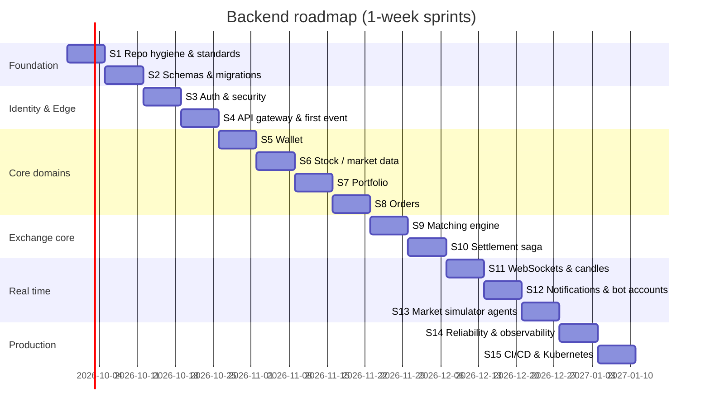

# Nexus Exchange — Backend Roadmap & Sprint Plan

> Cadence: **1-week sprints**, solo developer (≈ 5 focused days per sprint).
> Story IDs: `NX-<sprint><nn>`. Size: **S** ≈ ½ day, **M** ≈ 1 day, **L** ≈ 2 days.
> Every story's Definition of Done: code + tests + migration (if any) + Swagger/README updated + CI green + merged to `main` via PR.
> The frontend comes after Sprint 15 and is not planned here.

## Roadmap at a glance

| Phase | Sprints | Goal | Exit milestone |
|---|---|---|---|
| **A. Foundation** | 1–2 | Clean repo, standards, schemas, CI | Every service builds in CI, runs Flyway on its own DB, and returns real 501/200s |
| **B. Identity & edge** | 3–4 | Real auth + API gateway + first Kafka event | A user can register and log in through the gateway; a wallet is auto-created via Kafka |
| **C. Core domains** | 5–8 | Wallet, stocks, portfolio, orders | A user can deposit, browse stocks and place an order that reserves funds/shares |
| **D. Exchange core** | 9–10 | Matching engine + settlement saga | **Two users trade end-to-end**, with balances and holdings settled |
| **E. Real time & live market** | 11–13 | Live prices, order book, notifications, bots | Prices move on their own; clients see ticks and fills over WebSocket |
| **F. Production-ready** | 14–15 | Reliability, observability, load test, K8s | Full stack on Kubernetes, dashboards, a load-test report |
| G. Frontend | 16+ | React app (later) | — |

---

## Sprint 1 — Repo hygiene, standards & tech-stack decisions
**Goal:** a clean, consistent codebase that every later sprint builds on.

| ID | Story | Size | Acceptance criteria |
|---|---|---|---|
| NX-101 | Confirm tech stack & write ADRs | S | `docs/adr/0001…` records each (ADR) decision in architecture §2 |
| NX-102 | Git hygiene | S | Root `.gitignore` + `.gitattributes`; `target/` & `.idea/` untracked; line endings renormalised in one commit |
| NX-103 | Remove clutter | S | `untitled/` deleted; `connectivity-test-service` removed from modules and folder |
| NX-104 | Centralise dependency management | M | Root POM has `dependencyManagement` (Spring Cloud BOM, springdoc, mapstruct, testcontainers, jjwt), `pluginManagement`; child POMs carry no versions |
| NX-105 | Standardise user-service | M | Package `com.nexusexchange.user`, `application.yml`, actuator, springdoc, Dockerfile, README; tests still pass |
| NX-106 | Wire common-library into all services | M | All services depend on it; shared `GlobalExceptionHandler` auto-config; duplicate `ErrorResponse`/handlers deleted; `/api/v1` prefix applied |
| NX-107 | Fix common domain types | M | `BigDecimal`/`long` in all events & DTOs; `OrderSide` enum; `OrderStatus` = NEW, OPEN, PARTIALLY_FILLED, FILLED, CANCELLED, REJECTED; `BaseEvent` gets `EventType`, `correlationId`, `occurredAt` |
| NX-108 | Externalise config | S | Env-var placeholders for DB/Kafka/Redis/JWT; `.env.example`; profiles `local`/`docker` |
| NX-109 | Minimal CI | S | GitHub Actions: `mvn -B verify` on every PR and push to main |

## Sprint 2 — Infrastructure & database schemas
**Goal:** every service owns its database with versioned migrations.

| ID | Story | Size | Acceptance criteria |
|---|---|---|---|
| NX-201 | Compose: Kafka KRaft + Kafka UI | S | Zookeeper removed; Kafka UI at :8090; topics auto-created from a `kafka-init` job |
| NX-202 | DB-per-service init | S | `infra/postgres/init.sql` creates `user_db`, `wallet_db`, `order_db`, `portfolio_db`, `stock_db`, `matching_db`, `notification_db` |
| NX-203 | Flyway in every service | S | `ddl-auto: validate`; `V1__init.sql` per service; app fails fast on schema drift |
| NX-204 | User schema | S | `users`, `refresh_tokens` per architecture §5.1 |
| NX-205 | Wallet schema + entities | M | `wallets`, `wallet_transactions`, `fund_reservations`, `outbox`, `processed_events`; JPA entities with `@Version` |
| NX-206 | Stock schema + seed data | M | `stocks`, `stock_price_history`, `candles`; `V2__seed_stocks.sql` with ~20 symbols (TCS, INFY, RELIANCE…) |
| NX-207 | Order & matching schemas | M | `orders`, `order_fills`, `order_status_history`; `book_orders`, `trades` |
| NX-208 | Portfolio & notification schemas | S | `holdings`, `share_reservations`, `holding_transactions`; `notifications` |
| NX-209 | Testcontainers base | M | Shared abstract `IntegrationTest` (Postgres/Kafka/Redis) in a `test-support` module; one repository test per service |

## Sprint 3 — Authentication & security
**Goal:** real, secure identity.

| ID | Story | Size | Acceptance criteria |
|---|---|---|---|
| NX-301 | BCrypt password hashing | S | `PasswordEncoder` bean; mock hash removed; existing tests updated |
| NX-302 | JWT access tokens | M | HS256, 15 min, claims `sub`, `role`, `jti`; secret from env; `JwtService` unit-tested |
| NX-303 | Refresh & logout | M | `POST /auth/refresh` rotates the token (hashed in DB); `POST /auth/logout` revokes; reuse of a revoked token → 401 |
| NX-304 | Spring Security config | M | Stateless; `/auth/**` open; everything else authenticated; JSON 401/403 via common `ErrorResponse` |
| NX-305 | Profile endpoints | S | `GET/PUT /api/v1/users/me`; validation on update |
| NX-306 | Roles & admin seed | S | `ROLE_ADMIN` user seeded from env on startup; `@PreAuthorize` works |
| NX-307 | Auth integration tests | M | Register → login → refresh → me → logout flow against Testcontainers Postgres |

## Sprint 4 — API gateway & first Kafka event
**Goal:** a single entry point and the event backbone switched on.

| ID | Story | Size | Acceptance criteria |
|---|---|---|---|
| NX-401 | Create api-gateway module | M | Spring Cloud Gateway on :8080; routes per architecture §7; `/internal/**` never routed |
| NX-402 | JWT validation filter | M | Invalid/expired → 401; strips client `X-User-*`; injects `X-User-Id`, `X-User-Role` |
| NX-403 | Correlation id & logging | S | `X-Request-Id` generated if absent, propagated, in MDC; JSON logs in all services |
| NX-404 | CORS & rate limiting | S | CORS for `localhost:5173/3000`; Redis rate limiter (e.g. 20 req/s per user) returns 429 |
| NX-405 | Aggregated Swagger | S | Gateway Swagger UI lists all services |
| NX-406 | Outbox publisher (common) | L | Reusable outbox entity + scheduled publisher in common-library; unit + Testcontainers test |
| NX-407 | `UserCreated` event | S | user-service writes to outbox on register → `user-events` |
| NX-408 | Idempotent consumer (common) | M | `processed_events` helper + Kafka error handler with 3 retries → DLT |

## Sprint 5 — Wallet service
**Goal:** money moves correctly.

| ID | Story | Size | Acceptance criteria |
|---|---|---|---|
| NX-501 | Auto-create wallet | S | Consumes `UserCreated`; zero balances; duplicate event ignored |
| NX-502 | Get wallet | S | `GET /wallet` returns available/reserved/total |
| NX-503 | Deposit & withdraw | M | Positive amounts only, max limits; `Idempotency-Key` required; ledger row per operation; withdraw can't exceed available |
| NX-504 | Transaction history | S | `GET /wallet/transactions` paginated, newest first |
| NX-505 | Reservation API (internal) | M | `POST /internal/wallet/reservations` holds funds (idempotent on orderId); insufficient → 422; `DELETE` releases the remainder |
| NX-506 | Concurrency safety | M | Optimistic locking + retry; a test with 50 parallel reserves never goes negative |
| NX-507 | `WalletUpdated` events | S | Published via outbox after every balance change |

## Sprint 6 — Stock / market-data service
**Goal:** a catalogue of tradable instruments with cached prices.

| ID | Story | Size | Acceptance criteria |
|---|---|---|---|
| NX-601 | Stock queries | M | `GET /stocks` (search, sector, paging), `GET /stocks/{symbol}` |
| NX-602 | Admin stock management | M | `POST/PUT /admin/stocks`, `POST /admin/stocks/{symbol}/halt` (ADMIN only); validation on tick/lot size |
| NX-603 | Redis price cache | M | `stock:price:{SYMBOL}` written on update; reads go cache → DB; TTL + warm-up on startup |
| NX-604 | Price history API | S | `GET /stocks/{symbol}/history?from&to` |
| NX-605 | Internal price lookup | S | `GET /internal/stocks/{symbol}/quote` (LTP, tick, lot, status) for order-service |
| NX-606 | Day rollover job | S | Scheduled job sets `previous_close`, resets day OHLC/volume |
| NX-607 | Market movers | S | `GET /market/movers` top gainers/losers from Redis |
| NX-608 | Seed-data pipeline | M | `tools/seed-data/build_seed.py` turns Kaggle NIFTY CSVs into `data/stocks-seed.json` (last close, daily σ, avg volume, sector) for ~20 symbols; raw CSVs gitignored; stock-service loads the JSON on first start; dataset licence noted in README |

## Sprint 7 — Portfolio service
**Goal:** holdings with correct share reservations and valuation.

| ID | Story | Size | Acceptance criteria |
|---|---|---|---|
| NX-701 | Holdings query | M | `GET /portfolio` lists holdings with LTP (from Redis), market value, unrealised P&L |
| NX-702 | Portfolio summary | S | `GET /portfolio/summary`: invested, current value, total P&L, day P&L |
| NX-703 | Share reservation API (internal) | M | Reserve for SELL (idempotent on orderId); insufficient free qty → 422; release remainder |
| NX-704 | Average price & P&L logic | M | Pure domain class: weighted avg on buy, realised P&L on sell; property-based tests |
| NX-705 | Admin/dev seed holdings | S | Admin endpoint to grant shares (needed for bots & testing before an IPO flow exists) |
| NX-706 | Concurrency safety | S | `@Version` + retry; parallel reservation test |

## Sprint 8 — Order service
**Goal:** users can place, view and cancel orders.

| ID | Story | Size | Acceptance criteria |
|---|---|---|---|
| NX-801 | Order validation | M | Symbol exists & ACTIVE; qty > 0 and multiple of lot; LIMIT price > 0 and on tick; MARKET has no price; STOP types rejected |
| NX-802 | Place order + reservation | L | `POST /orders` → NEW → reserve (wallet for BUY, portfolio for SELL) via Resilience4j client → OPEN or REJECTED with reason; `Idempotency-Key` → same response on retry |
| NX-803 | Publish `PlaceOrder` command | S | Outbox → `order-commands` keyed by symbol |
| NX-804 | Query orders | S | `GET /orders` (filters, paging), `GET /orders/{id}` (only the owner's orders) |
| NX-805 | Cancel order | M | `DELETE /orders/{id}` allowed for OPEN/PARTIALLY_FILLED; publishes `CancelOrder`; status updated when the engine confirms |
| NX-806 | State machine | S | Illegal transitions throw; every change written to `order_status_history` |
| NX-807 | Failure handling | M | If reservation times out → REJECTED and a compensating release call; tests with WireMock |

## Sprint 9 — Matching engine
**Goal:** a correct, fast, well-tested exchange core.

| ID | Story | Size | Acceptance criteria |
|---|---|---|---|
| NX-901 | `matching-core` library | L | Pure Java `OrderBook`: TreeMap price levels, FIFO queues, price-time priority; LIMIT & MARKET (IOC); partial fills; cancel |
| NX-902 | Matching rule tests | M | ≥ 30 scenario tests (crossing, partials, multi-level sweep, market with thin book, self-trade prevention, cancel of a partial) |
| NX-903 | matching-engine service | M | Spring app :8086 consuming `order-commands`, one book per symbol, single thread per partition |
| NX-904 | Persist book & trades | M | `book_orders` + `trades` + outbox in one transaction; duplicate command ignored |
| NX-905 | Emit events | S | `TradeExecuted` → `trade-events`; `OrderAccepted/Cancelled/Rejected` → `order-events` |
| NX-906 | Recovery on restart | M | Books rebuilt from `book_orders`; test kills the engine mid-stream with no lost/duplicate trades |
| NX-907 | Order book snapshot API | S | `GET /internal/orderbook/{symbol}?depth=10`; throttled `OrderBookUpdated` events |
| NX-908 | Micro-benchmark | S | JMH benchmark in the repo; record the p99 per-order latency |
| NX-909 | LOBSTER replay test | M | Adapter converts a LOBSTER sample message file into engine commands; replay one day; trades and top-of-book stay consistent (no crossed book, no negative qty); throughput recorded |

## Sprint 10 — Trade settlement saga
**Goal:** trades settle atomically across services; the ledger always balances.

| ID | Story | Size | Acceptance criteria |
|---|---|---|---|
| NX-1001 | Wallet settlement | M | On `TradeExecuted`: buyer consumes reserve (and releases any price improvement), seller is credited; idempotent by tradeId |
| NX-1002 | Portfolio settlement | M | Buyer +qty & avg price; seller consumes reserved qty & records realised P&L; idempotent |
| NX-1003 | Order updates | M | `filled_quantity`, `avg_fill_price`, `order_fills`; status PARTIALLY_FILLED/FILLED |
| NX-1004 | Cancel/reject releases | S | `OrderCancelled`/`OrderRejected` → wallet/portfolio release remaining reservations |
| NX-1005 | Stock price from trades | S | stock-service updates LTP/OHLC/volume, Redis and history; publishes `StockPriceUpdated` |
| NX-1006 | Compensation flow | M | `SettlementFailed` → reverse the other leg; trade marked SETTLEMENT_FAILED; test with a forced failure |
| NX-1007 | End-to-end test | L | Testcontainers stack: 2 users, deposit, grant shares, BUY vs SELL, assert balances, holdings, orders, trade, price |
| NX-1008 | Reconciliation job | S | Nightly check: sum of wallets + reserved == deposits − withdrawals; shares conserved per symbol |

## Sprint 11 — Real-time streaming & candles
**Goal:** live market data for clients.

| ID | Story | Size | Acceptance criteria |
|---|---|---|---|
| NX-1101 | WebSocket/STOMP endpoint | M | `/ws` in stock-service; `/topic/prices`, `/topic/prices/{symbol}` broadcast on `StockPriceUpdated` |
| NX-1102 | Order book stream | S | `/topic/orderbook/{symbol}` from `OrderBookUpdated` |
| NX-1103 | Gateway WS routing + auth | M | Gateway proxies `/ws`; JWT checked on the STOMP CONNECT frame |
| NX-1104 | Candles | M | 1-minute candles built from trades; 5m/1h/1d via aggregation; `GET /stocks/{symbol}/candles` |
| NX-1105 | Scale-out broadcast | S | Redis pub/sub (or Kafka) fan-out so multiple stock-service instances broadcast the same ticks |
| NX-1106 | WS test client | S | Small Java/Node script that subscribes and prints ticks (used in demos) |

## Sprint 12 — Notifications & simulator foundation
**Goal:** users are informed, and bot accounts exist and can trade.

| ID | Story | Size | Acceptance criteria |
|---|---|---|---|
| NX-1201 | notification-service module | M | :8087, consumes trade/order/wallet events, stores `notifications` |
| NX-1202 | Notification APIs | S | `GET /notifications`, `PUT /notifications/{id}/read` |
| NX-1203 | Per-user push | M | `/user/queue/notifications` and `/user/queue/orders` over STOMP |
| NX-1204 | market-simulator module & bot accounts | M | Spring app :8088; on startup registers `bot_*` users (`ROLE_BOT`) through the gateway, funds wallets & grants holdings via admin APIs; idempotent on restart; `simulator.yml` config binding |
| NX-1205 | Bot trading client | S | Gateway client that logs bots in, refreshes tokens, places/cancels orders with `Idempotency-Key`, respects 429s |
| NX-1206 | Email stub | S | `NotificationChannel` interface with a log-only email implementation (real SMTP later) |

## Sprint 13 — Market simulator agents
**Goal:** the market is alive: realistic prices with no outside feed.

| ID | Story | Size | Acceptance criteria |
|---|---|---|---|
| NX-1301 | Fair-value engine (GBM) | M | Per-symbol GBM from `stocks-seed.json` (σ, μ); fixed random seed gives a reproducible path; unit test checks realised σ ≈ configured σ |
| NX-1302 | Market-maker agent | M | Quotes 3 levels on each side around fair value; spread in ticks; inventory skew; re-quotes when fair value moves > 1 tick; book never empty during a 30-min run |
| NX-1303 | Noise-trader agents | S | Poisson arrivals scaled from `avgDailyVolume`; random side/size; ~20% MARKET |
| NX-1304 | Value & momentum agents | M | Value trades toward fair value past a threshold; momentum uses MA crossover on `price-events`; both configurable |
| NX-1305 | Historical replay mode | M | Fair value follows a chosen Kaggle day, time-compressed and interpolated; switchable at runtime |
| NX-1306 | Scenarios & admin controls | S | `calm`, `volatile`, `trend-up/down`, `crash`, `replay:<date>`; `POST /admin/simulator/{start,stop,scenario}`; rate setting |
| NX-1307 | Guards & metrics | S | Per-bot balance checks, global orders/sec cap, circuit breaker at ±10% from fair value; Micrometer metrics (orders by agent, spread, deviation) |

## Sprint 14 — Reliability & observability
**Goal:** see and survive failures.

| ID | Story | Size | Acceptance criteria |
|---|---|---|---|
| NX-1401 | Metrics | M | Prometheus scrapes all services; custom metrics: orders placed, trades, match latency, consumer lag |
| NX-1402 | Grafana dashboards | M | Dashboards committed as JSON: service health, JVM, Kafka lag, trading KPIs |
| NX-1403 | Distributed tracing | M | OpenTelemetry → Tempo/Zipkin; one trace spans gateway → order → Kafka → engine → wallet |
| NX-1404 | DLT admin | S | `GET /admin/dlt`, `POST /admin/dlt/{id}/replay` |
| NX-1405 | Resilience review | S | Timeouts/retries/circuit breakers on all sync calls; readiness probes check dependencies |
| NX-1406 | Load test | M | k6 scripts: 1k orders/s for 5 min; report in `docs/perf/` |
| NX-1407 | Chaos checks | S | Kill Kafka / a service mid-load; verify recovery and reconciliation passes |

## Sprint 15 — CI/CD & Kubernetes
**Goal:** one-command deploy, a portfolio-ready repo.

| ID | Story | Size | Acceptance criteria |
|---|---|---|---|
| NX-1501 | Container images | M | Multi-stage Dockerfiles or Jib, non-root, healthchecks; images < 250 MB |
| NX-1502 | CI pipeline | M | Build matrix, unit + integration tests, coverage report (JaCoCo ≥ 70% on domain), push images to GHCR on main |
| NX-1503 | Full-stack compose | S | `docker compose --profile full up` runs everything incl. observability |
| NX-1504 | Kubernetes manifests | L | Kustomize base/overlays; Deployments, Services, ConfigMaps, Secrets, Ingress, HPA; Kafka/Postgres/Redis via Helm; runs on kind |
| NX-1505 | CD to local cluster | S | Workflow or script `make deploy-k8s` |
| NX-1506 | Final docs | M | README with diagrams, run guide, API guide, ADRs, demo script; architecture doc updated to "as built" |

---

## Backlog (nice to have, after the MVP)
- STOP / STOP_LIMIT orders and a GTT (good-till-triggered) service
- Brokerage & tax simulation, contract notes
- Price alerts (`price-events` → notification)
- Watchlists
- RS256 + JWKS, OAuth2 login (Google)
- Debezium CDC instead of an outbox poller
- Event-sourced matching engine with snapshots
- Leaderboard of top traders (Redis sorted set)
